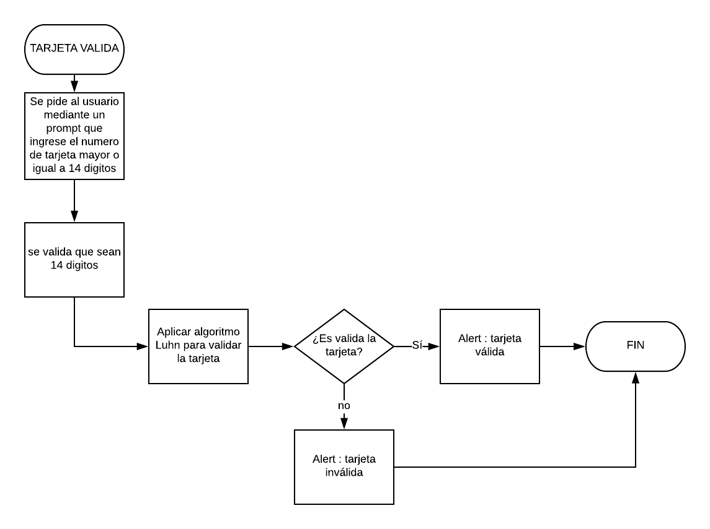

# Productos Finales

## Descripcion de cada producto

### CIFRADO CÉSAR

Crea una web que pida, por medio de un prompt(), una frase al usuario y devuelva el mismo mensaje encriptado según el algoritmo de Cifrado César con el parámetro de desplazamiento de 33 espacios hacia la derecha

Por ejemplo:

Texto original: ABCDEFGHIJKLMNOPQRSTUVWXYZ
Texto codificado: HIJKLMNOPQRSTUVWXYZABCDEFG

### TARJETA DE CRÉDITO VÁLIDA

Crea una web que pida, por medio de un prompt(), el número de una tarjeta de crédito y confirme su validez según el algoritmo de Luhn. Lee este blog que explica cómo funciona el algoritmo de Luhn.

Consideraciones Específicas

Tu código debe estar compuesto por 1 función: isValidCard
El usuario no debe poder ingresar un campo vacío

## Pseudocódigo
### Descripción

1. Pedir, mediante un prompt, que el usuario ingrese el numero de la tarjeta a verificar con un rango no mayor a 15 digitos
2. Validar que los datos no contengan letras, espacios vacios o caracteres extraños
3. En caso de que pase la primera evaluacion, se aplica el algoritmo de Luhn para su validacion
4. Imprimir los resultados de si esa válida o no la tarjeta mediante un alert.
5. Terminar el proceso.    

## Diagrama de flujo
Nota. El diseño del diagrama de flujo esta basado en https://sites.google.com/a/itesm.mx/proyecto-1erparcial-multimedia-itesmaa3700/menu-de-opciones-con-un-diagrama-de-flujo .

